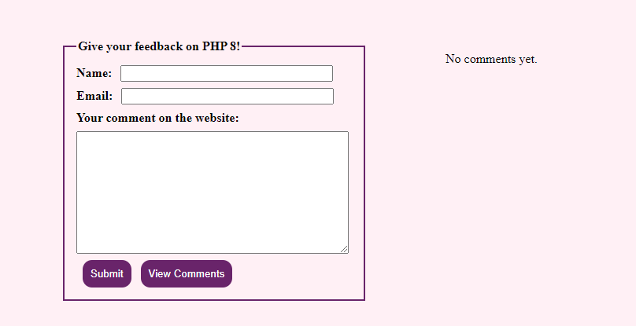
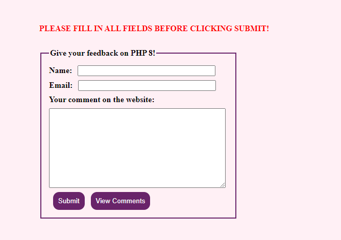
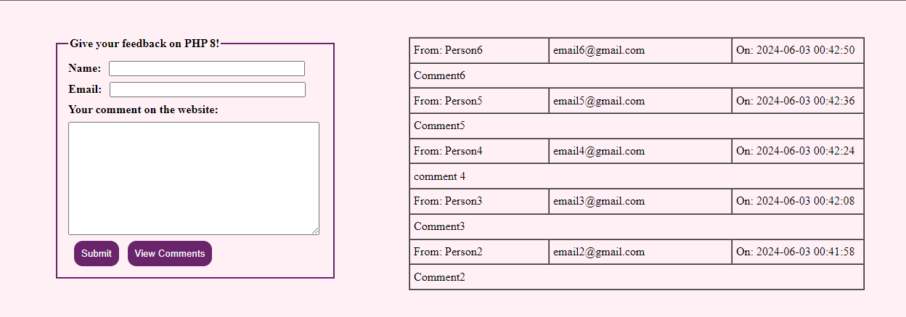

## Description
A simple web application that allows users to submit comments and view the 5 latest comments. The application uses PHP for backend processing and JSON for data storage. It provides basic form validation and error handling to ensure that all fields are properly filled out before submitting a comment.

## Screenshots

